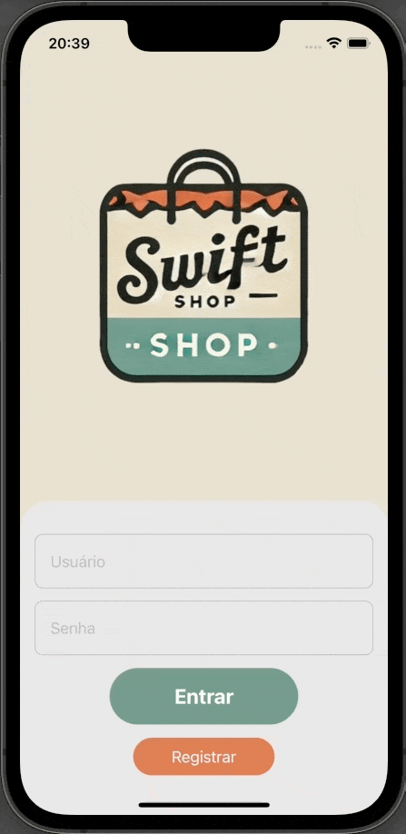
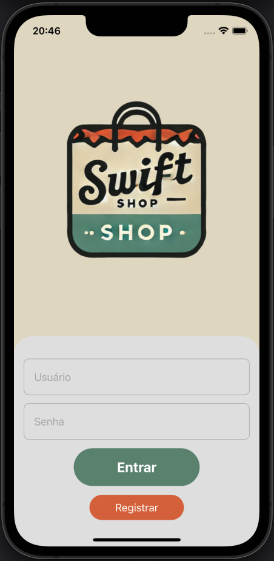
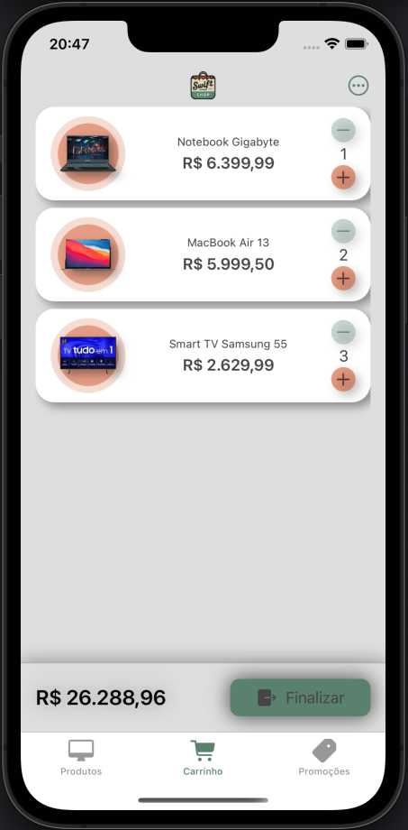

# 📝 Swift Shop SwiftUI / MVVM / Firebase

Projeto de um **app simulador de compras** chamado de SwiftShop utilizando a arquitetura **MVVM**, interfaces implementadas com **SwiftUI** e integração com **Authentication** e **Firestore Database** do **Firebase** . Este projeto inclui:

✨ **Principais Funcionalidades**:
- Arquitetura **MVVM** para separação de responsabilidades;
- Implementação de interfaces com **SwiftUI**;
- Integração com **Authentication** do **Firebase** para cadastro e login de usuário;
- Integração com **Firestore Database** do **Firebase** para persistência de dados como cadastro de categorias, produtos e carrinho de produtos do usuário;
- Dados Fake com Mocks para visualização correta de previews;
- Estruturas (`structs`) customizadas;
- Cadastro de usuário com verificação de senha com no mínimo 6 digitos e usuário já cadastrado;
- Verificação de e-mail de usuário válido com **Authentication** do **Firebase**;
- Login e validação de usuário já logado com **Authentication** do **Firebase** (Caso usuário já logado, irá diretamente para tela de produtos ao abrir App);
- Tela ScrollView com produtos pré-cadastrados no **Firestore Database**;
- Tela de Produtos possui Scroll Horizontal com categorias pré-cadastradas no **Firestore Database** para filtragem de produtos;
- Tela para visualizar promoções. Irá mostrar apenas produtos com campo valor de promoção preenchido nos pré-cadastros de produtos;
- Tela para visualizar itens no carrinho;
- Os produtos são dispostos em cards clicáveis que abrem os detalhes desse produto e botão para adicionar no carrinho;
- Carrinho possui funcionalidade de alterar quantidade, excluir item e finalizar compra;
- Itens do carrinho são salvos no usuário no **Firestore Database**;

## 🛠 Requisitos
- **macOS** 11 ou superior
- **Xcode** 12 ou superior
- **Swift** 5.3 ou superior

## 📦 Dependências Externas
Este projeto **não possui dependências externas**, como web services. Basta rodar o projeto diretamente para utilizá-lo.

## 📸 Imagens

  
  
  
  

## 🚀 Como Rodar o Projeto
1. Abra o projeto no **Xcode**.
2. Selecione um simulador ou dispositivo real.
3. Execute o app clicando no botão **Run** ou usando o atalho `Cmd + R`.

## 📄 Licença

Copyright (c) 2025 Fernando Schulz

Permission is hereby granted, free of charge, to any person obtaining a copy of this software and associated documentation files (the "Software"), to deal in the Software without restriction, including without limitation the rights to use, copy, modify, merge, publish, distribute, sublicense, and/or sell copies of the Software, and to permit persons to whom the Software is furnished to do so, subject to the following conditions:

The above copyright notice and this permission notice shall be included in all copies or substantial portions of the Software.

THE SOFTWARE IS PROVIDED "AS IS", WITHOUT WARRANTY OF ANY KIND, EXPRESS OR IMPLIED, INCLUDING BUT NOT LIMITED TO THE WARRANTIES OF MERCHANTABILITY, FITNESS FOR A PARTICULAR PURPOSE AND NONINFRINGEMENT. IN NO EVENT SHALL THE AUTHORS OR COPYRIGHT HOLDERS BE LIABLE FOR ANY CLAIM, DAMAGES OR OTHER LIABILITY, WHETHER IN AN ACTION OF CONTRACT, TORT OR OTHERWISE, ARISING FROM, OUT OF OR IN CONNECTION WITH THE SOFTWARE OR THE USE OR OTHER DEALINGS IN THE SOFTWARE.
